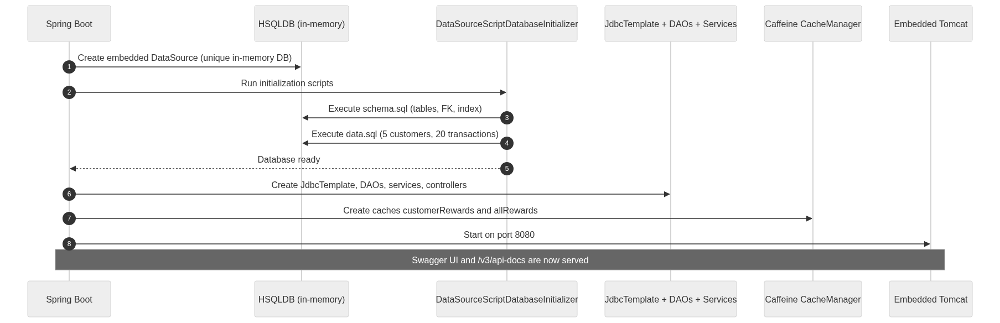
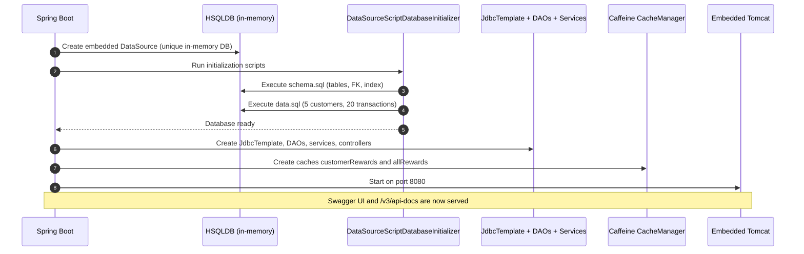
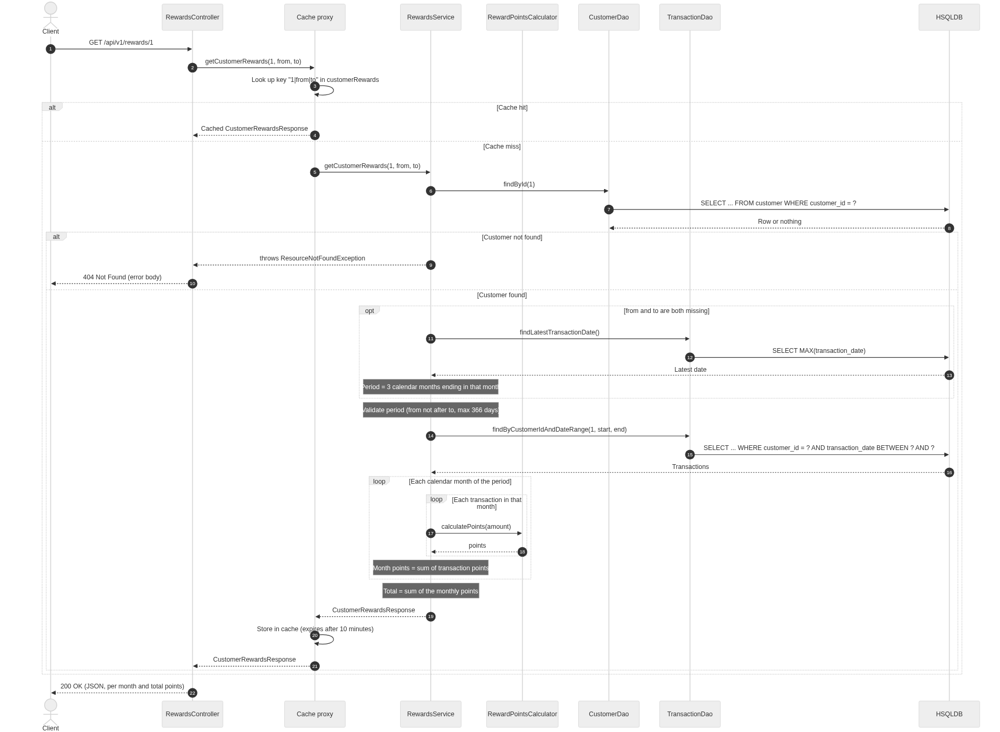
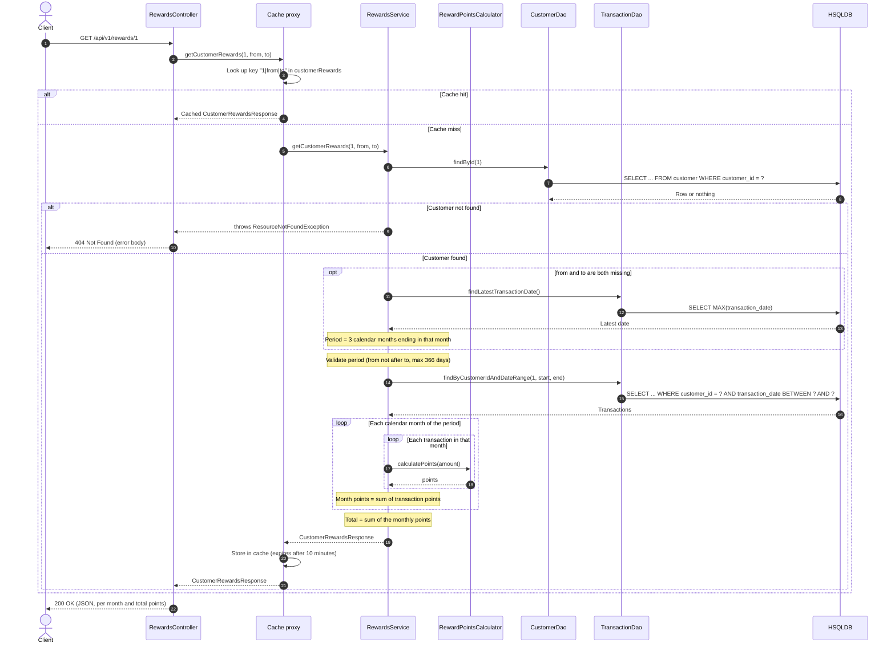
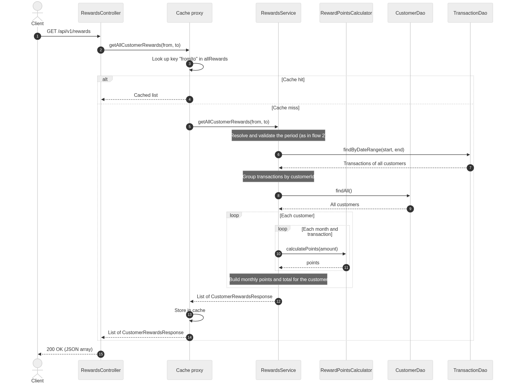
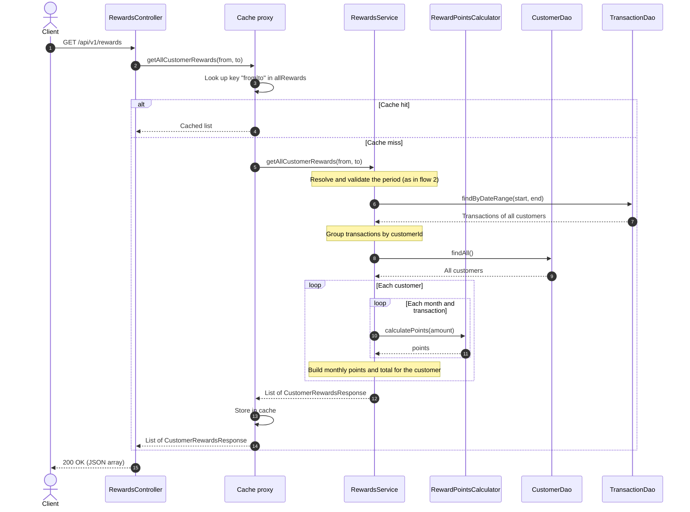
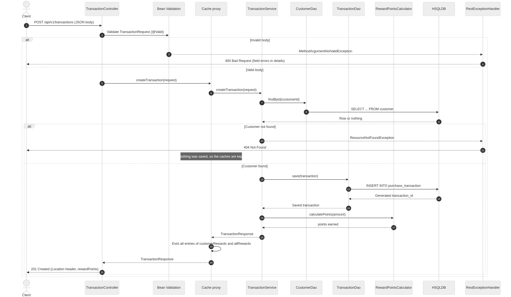
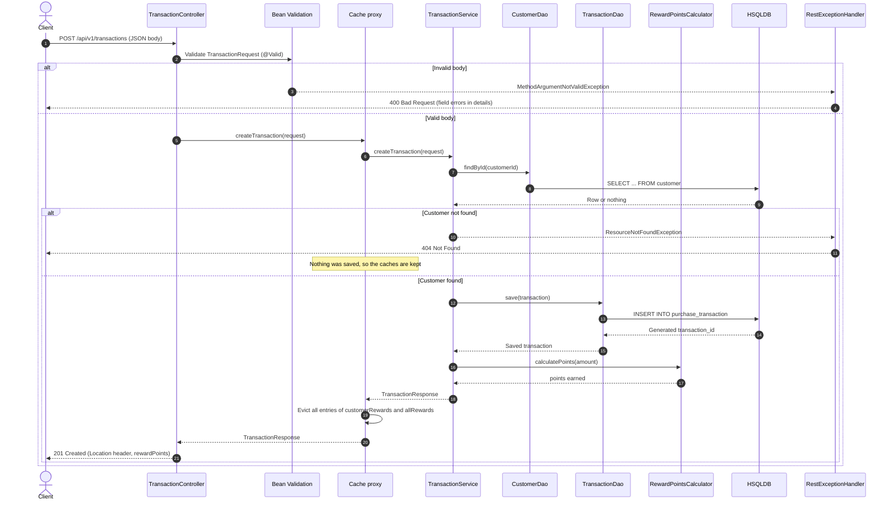
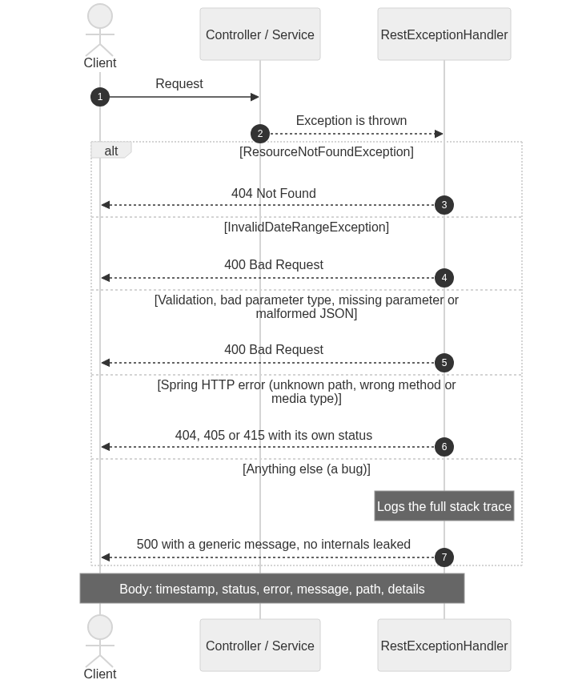
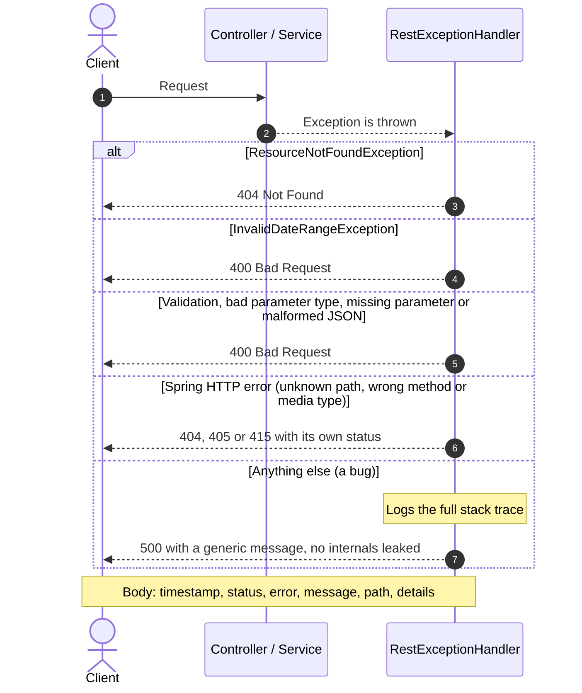

# Design document

This document describes how the Customer Rewards Service is put together: the layers, the request flows, the
caching strategy and the decisions behind them. For what the service does, how to run it and the API reference, see
the [README](../README.md).

## Architecture

The service is a single Spring Boot process with four layers. Each layer only talks to the one directly below it:

```
Client -> Controller -> Service (cache in front) -> DAO -> HSQLDB
```

| Layer | Classes | Responsibility |
|---|---|---|
| Controller | `RewardsController`, `TransactionController`, `CustomerController` | HTTP mapping, parameter parsing, request validation |
| Service | `RewardsService`, `TransactionService`, `CustomerService`, `RewardPointsCalculator` | Period rules, points calculation, caching |
| DAO | `JdbcCustomerDao`, `JdbcTransactionDao` | SQL only, no business rules |
| Error handling | `RestExceptionHandler` | Converts every exception into the standard JSON error body |

There is no separate persistence model: `Customer` and `PurchaseTransaction` (in `model/`) are used by both the DAO
and service layers, and are mapped to their own request/response DTOs (in `dto/`) at the controller boundary. This
keeps the internal model free to change without breaking the API, and keeps validation annotations
(`@NotNull`, `@DecimalMin`, ...) out of the domain objects.

## Package structure

```
src/main/java/com/spectrum/customer/rewards
├── CustomerRewardsServiceApplication.java   Spring Boot entry point
├── config/        CacheConfig (enables caching, cache names), OpenApiConfig (Swagger metadata)
├── controller/    REST controllers: Rewards, Transactions, Customers
├── service/       RewardsService (calculation + caching), TransactionService, CustomerService,
│                  RewardPointsCalculator (the points rules)
├── dao/           DAO interfaces: CustomerDao, TransactionDao
│   └── impl/      JdbcTemplate implementations
├── model/         Domain objects: Customer, PurchaseTransaction
├── dto/           API request/response objects and the error body
└── exception/     Custom exceptions and the @RestControllerAdvice error handler

src/main/resources
├── application.properties   Server, cache, Swagger and actuator settings
├── schema.sql               Table definitions
└── data.sql                 Sample data set

src/test/java/...            Unit tests (calculator, services), controller tests (MockMvc),
                             DAO tests (@JdbcTest) and end-to-end tests (@SpringBootTest)
```

## Request flows

The diagrams below are rendered as PNG images (under [diagrams](diagrams)) so they display in any Markdown viewer,
not only ones that support [Mermaid](https://mermaid.js.org/). Each image is followed by its editable Mermaid source
in a collapsed section.

### 1. Application startup

The database is created and filled before the first request can arrive.



<details>
<summary>Diagram source</summary>



</details>

### 2. Get the rewards of one customer

`GET /api/v1/rewards/{customerId}?from=&to=`

The Spring cache proxy sits in front of `RewardsService`, so a cache hit never reaches the DAOs. Errors are not
cached.



<details>
<summary>Diagram source</summary>



</details>

### 3. Get the rewards of all customers

`GET /api/v1/rewards?from=&to=`

Same idea, but it needs only **one** transaction query for all customers. The result is split per customer in memory.
Customers without purchases are still listed, with 0 points.



<details>
<summary>Diagram source</summary>



</details>

### 4. Record a purchase

`POST /api/v1/transactions`

A new purchase can change any customer's totals, so both caches are emptied after a successful save.
The next read recalculates from the database.



<details>
<summary>Diagram source</summary>



</details>

### 5. How errors are returned

Controllers and services never build error responses. They throw, and `RestExceptionHandler` turns the exception
into one consistent JSON body.



<details>
<summary>Diagram source</summary>



</details>

## Caching design

The service layer caches calculated rewards with Caffeine, fronting `RewardsService` through Spring's
`@Cacheable`/`@CacheEvict` proxies:

| Cache | Key | Holds |
|---|---|---|
| `customerRewards` | `customerId + "|" + from + "|" + to` | One customer's `CustomerRewardsResponse` for a period |
| `allRewards` | `from + "|" + to` | The `List<CustomerRewardsResponse>` for a period |

- **Expiry:** entries expire 10 minutes after being written, and each cache holds at most 1000 entries
  (`spring.cache.caffeine.spec` in `application.properties`). This bounds memory and acts as a safety net even if
  eviction is ever missed.
- **Eviction on write:** `TransactionService.createTransaction` is annotated to evict **all** entries of both caches,
  and only runs after the insert succeeds (an unknown customer throws before the DAO is called, so nothing is
  evicted or stale). All entries are cleared, rather than a single key, because one new purchase can affect several
  cached results at once: the customer's own report, the all-customers report, and any period whose range includes
  the purchase date. It can also shift the *default* period, which is anchored on the latest transaction date
  rather than "today" (see [Period resolution](#period-resolution)). Clearing everything is simple and always
  correct; the cost is that the next read after any write recomputes from the database regardless of which customer
  or period it touches.
- **Not cached:** exceptions are never cached (`@Cacheable` only stores normal returns), so a 404 or 400 is
  recalculated on every request; `CustomerService` has no cache, since the customer list is not derived data.

### Known limits

- **Single JVM only:** the cache lives in process memory. Running multiple instances behind a load balancer would
  let one instance evict its own cache on a write while another keeps serving a stale result for up to 10 minutes.
  A shared cache (e.g. Redis) would be needed to scale out.
- **Read/write race:** a read that started just before a write completes could store a just-stale result right after
  the eviction. The 10 minute expiry bounds how long that can persist. Acceptable for a rewards report; would need
  a different strategy (e.g. versioned keys) if strict read-after-write consistency were required.

## Period resolution

`RewardsService.resolvePeriod` implements the rules behind the optional `from`/`to` query parameters:

| Given | Period reported |
|---|---|
| `from` and `to` | exactly that period (`from` must not be after `to`, at most 366 days) |
| only `to` | the 3 calendar months ending with the month of `to` |
| only `from` | the 3 calendar months starting with the month of `from` |
| neither | the 3 calendar months ending with the month of the **latest transaction** in the database |

The "neither" case is anchored on the latest transaction date rather than the current date so that the report stays
meaningful for a fixed, historical sample data set instead of silently going empty as real time moves past it.

## Design decisions

- **Spring MVC instead of WebFlux:** the DAO layer uses blocking JDBC, so the servlet stack is the natural fit; a
  reactive front end over a blocking back end would only add complexity.
- **JdbcTemplate over an ORM:** the queries are simple (a handful of `SELECT`/`INSERT` statements against two
  tables), so plain `JdbcTemplate`/`NamedParameterJdbcTemplate` keeps the SQL explicit and avoids the mapping
  configuration an ORM like JPA/Hibernate would need for two entities.
- **`NamedParameterJdbcTemplate` for the transaction DAO:** its queries have three or four parameters
  (`customerId`, `from`, `to`, ...); named parameters (`:from`) are self-documenting at the call site, where
  positional `?` markers would need to be matched up by position. `JdbcCustomerDao`'s queries have at most one
  parameter, so plain `JdbcTemplate` is used there instead.
- **Rules live in one place:** `RewardPointsCalculator` is a small, pure component (amount in, points out), so the
  business rule is easy to unit test in isolation and easy to change if the rules change.
- **Points are computed in Java, not SQL:** the DAO only fetches transactions for the period; grouping by month and
  applying the rules happens in the service layer. This keeps the reward rule out of SQL, where it would be harder
  to test and to read.
- **Immutable DTOs and model classes (`@Value`):** `CustomerRewardsResponse` and friends are cached, so making them
  immutable rules out a caller mutating a cached instance and corrupting what every subsequent cache hit returns.
  `TransactionRequest` is the one exception (`@Data`, mutable, no-args constructor), because Jackson deserializes
  request bodies into it.
- **One error body, one handler:** every controller lets exceptions propagate; `RestExceptionHandler` is the single
  place that maps an exception type to an HTTP status and builds the JSON error body. This keeps the controllers
  free of `try`/`catch` and guarantees a consistent error shape.
- **In-memory HSQLDB, not H2:** functionally interchangeable for this exercise; HSQLDB was the one already
  referenced in the starting `pom.xml`. Swapping to H2 or a real database would only mean changing the dependency
  and the driver, since access goes through Spring's `DataSource` abstraction either way.

## Known limitations / possible improvements

- **No pagination:** `GET /api/v1/rewards` (all customers) and `GET /api/v1/customers` return every row. Acceptable
  for the sample data set (5 customers); with a large customer base, `GET /api/v1/rewards` would become the first
  bottleneck, since it also loads every transaction in the period into memory. `GET /api/v1/rewards/{customerId}`
  does not need pagination: it returns at most one entry per month, and the period is capped at 366 days.
- **Single JVM cache:** see [Known limits](#known-limits) above; would need a shared cache to run multiple instances.
- **In-memory database:** all data is lost on restart by design (this is a demo/take-home service with a seeded
  sample data set, not a production data store).
